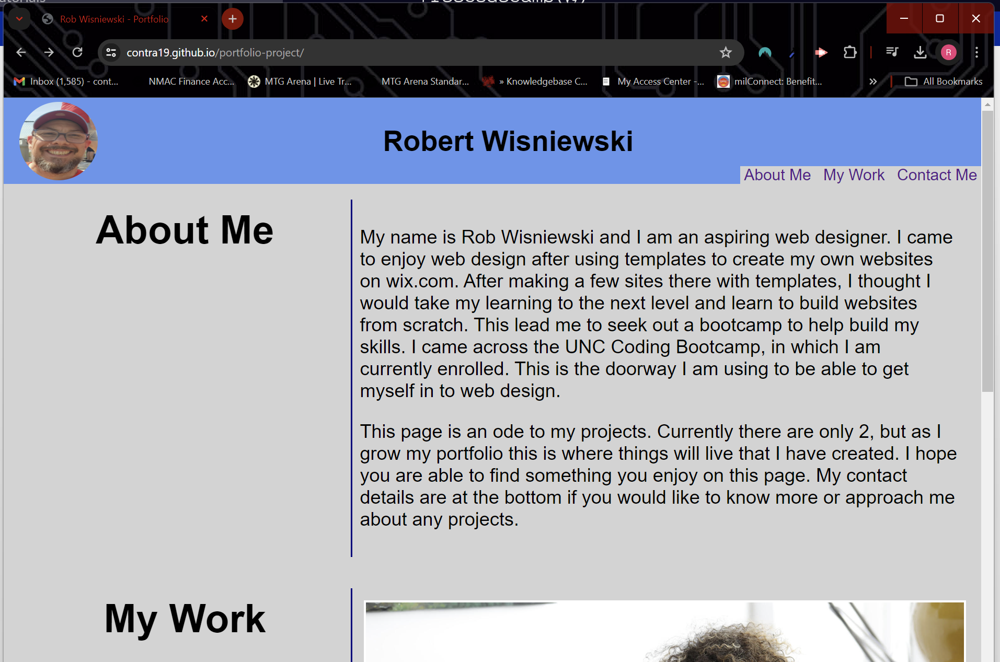

# Rob Wisniewski Portfolio

## A showcase of projects/websites that Rob has created

## Description
Welcome to my showcase! This is where you will be abl;e to find a portfolio of the projects I am currently working on or have worked on in the past. My intent is for this to be a place for mew to display my talents and for others, especially prospective employers/customers, to find samples of my work. 

These works use several technologies and more will be added as I experiment more with others. Currently HTML and CSS are utilized with JavaScript coming in the near future. 

## Usage
There is no installation necessary for this project as you can go directly to https://contra19.github.io/portfolio-project/ to see my portfolio in an interactive way. You can use the page to see my projects and go directly to them. If you have a specific project you want to look at in mind and want to skip going to the page, you will find a list of all the included projects below. 

## List of included projects
1. Prework Study Guiide (https://contra19.github.io/portfolio-project/)
2. Horiseon Recode (https://contra19.github.io/module_1_challenge/)

## Credits
Collaboration credit to my classmates Katelyn Hardigree and NIck Zamboni who provided verbal input for me to verify and adjust my code accordingly as well as provide some
inspiration. Their input helped me to shape the page that is being presented. Links to their profiles will be included here as soon as I am able to get them. 

## License
The MIT License

Copyright (c) 2024 Robert Wisniewski

Permission is hereby granted, free of charge, to any person obtaining a copy of this software and associated documentation files (the "Software"), to deal in the Software without restriction, including without limitation the rights to use, copy, modify, merge, publish, distribute, sublicense, and/or sell copies of the Software, and to permit persons to whom the Software is furnished to do so, subject to the following conditions:

The above copyright notice and this permission notice shall be included in all copies or substantial portions of the Software.

THE SOFTWARE IS PROVIDED "AS IS", WITHOUT WARRANTY OF ANY KIND, EXPRESS OR IMPLIED, INCLUDING BUT NOT LIMITED TO THE WARRANTIES OF MERCHANTABILITY, FITNESS FOR A PARTICULAR PURPOSE AND NONINFRINGEMENT. IN NO EVENT SHALL THE AUTHORS OR COPYRIGHT HOLDERS BE LIABLE FOR ANY CLAIM, DAMAGES OR OTHER LIABILITY, WHETHER IN AN ACTION OF CONTRACT, TORT OR OTHERWISE, ARISING FROM, OUT OF OR IN CONNECTION WITH THE SOFTWARE OR THE USE OR OTHER DEALINGS IN THE SOFTWARE.